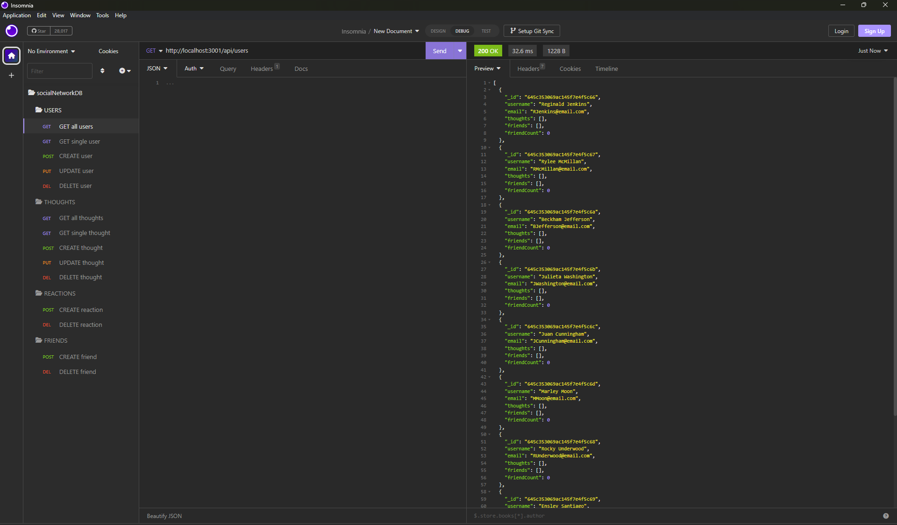

# NoSQL Social Network API
## Description
The NoSQL Social Network API is to demonstrate backend functionality of an imaginary social network. The work is an exercise to explore and learn Mongoose capabilities.  

## Technologies and installation
Technologies used include:
- Express
- Mongoose
- MongoDBCompass
- Insomnia

Install the required packages by running npm install. Start your local server by running npm start.  

## Code sources
Beyond the bootcamp materials and about 40 hours of personal effort, this code was assembled with help from teaching assistants, tutoring sessions and GitHub examples.  

## Walkthrough video
https://drive.google.com/file/d/13AVX3rkJZBdLRBOrl16apcGZPX6JAJuk/view  

## Screenshot

